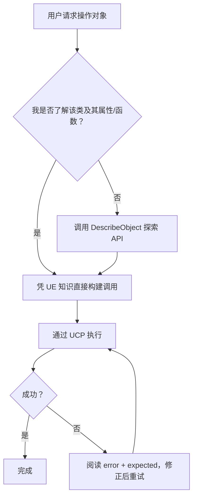

# 对象操作

通过 UCP 的 `call` 命令操作 UObject。本 Skill 涵盖两个函数库：一个运行时可用，一个仅编辑器可用。

**前置条件**：UE 编辑器运行中，UCP 插件已启用。

---

## 运行时

### UObjectOperationLibrary

**CDO 路径**：`/Script/UnrealClientProtocol.Default__ObjectOperationLibrary`

| 函数 | 参数 | 说明 |
|------|------|------|
| `GetObjectProperty` | `ObjectPath`, `PropertyName` | 读取 UPROPERTY，返回属性值的 JSON |
| `SetObjectProperty` | `ObjectPath`, `PropertyName`, `JsonValue` | 写入 UPROPERTY（编辑器中支持 Undo）。JsonValue 为 JSON 字符串。 |
| `DescribeObject` | `ObjectPath` | 返回类信息、所有属性（含当前值）和所有函数 |
| `DescribeObjectProperty` | `ObjectPath`, `PropertyName` | 返回属性的详细元数据和当前值 |
| `DescribeObjectFunction` | `ObjectPath`, `FunctionName` | 返回完整函数签名及参数类型 |
| `FindObjectInstances` | `ClassName`, `Limit`（默认 100） | 按类路径查找 UObject 实例 |
| `FindDerivedClasses` | `ClassName`, `bRecursive`（默认 true）, `Limit`（默认 500） | 查找类的所有子类 |
| `ListComponents` | `ObjectPath` | 列出 Actor 上挂载的所有组件 |
| `FindObjectsByOuter` | `OuterPath`, `ClassName`（默认 ""）, `Limit`（默认 100） | 查找指定 Outer 对象拥有的子对象 |

### 示例

**读取属性：**
```json
{"object":"/Script/UnrealClientProtocol.Default__ObjectOperationLibrary","function":"GetObjectProperty","params":{"ObjectPath":"/Game/Maps/Main.Main:PersistentLevel.StaticMeshActor_0.StaticMeshComponent0","PropertyName":"RelativeLocation"}}
```

**写入属性：**
```json
{"object":"/Script/UnrealClientProtocol.Default__ObjectOperationLibrary","function":"SetObjectProperty","params":{"ObjectPath":"/Game/Maps/Main.Main:PersistentLevel.StaticMeshActor_0.StaticMeshComponent0","PropertyName":"RelativeLocation","JsonValue":"{\"X\":100,\"Y\":200,\"Z\":0}"}}
```

**查找实例：**
```json
{"object":"/Script/UnrealClientProtocol.Default__ObjectOperationLibrary","function":"FindObjectInstances","params":{"ClassName":"/Script/Engine.StaticMeshActor","Limit":50}}
```

**探索陌生对象：**
```json
{"object":"/Script/UnrealClientProtocol.Default__ObjectOperationLibrary","function":"DescribeObject","params":{"ObjectPath":"/Game/Maps/Main.Main:PersistentLevel.BP_CustomActor_C_0"}}
```

**列出 Actor 的组件：**
```json
{"object":"/Script/UnrealClientProtocol.Default__ObjectOperationLibrary","function":"ListComponents","params":{"ObjectPath":"/Game/Maps/Main.Main:PersistentLevel.StaticMeshActor_0"}}
```

**按 Outer 查找对象：**
```json
{"object":"/Script/UnrealClientProtocol.Default__ObjectOperationLibrary","function":"FindObjectsByOuter","params":{"OuterPath":"/Game/Maps/Main.Main:PersistentLevel","ClassName":"/Script/Engine.StaticMeshActor","Limit":50}}
```

---

## 仅编辑器

### UObjectEditorOperationLibrary

**CDO 路径**：`/Script/UnrealClientProtocolEditor.Default__ObjectEditorOperationLibrary`

| 函数 | 参数 | 说明 |
|------|------|------|
| `UndoTransaction` | `Keyword`（可选，默认 ""） | 撤销最近的编辑器事务。设置 Keyword 时仅在栈顶事务包含该关键词时撤销。 |
| `RedoTransaction` | `Keyword`（可选，默认 ""） | 重做最近撤销的事务。设置 Keyword 时仅在栈顶事务包含该关键词时重做。 |
| `GetTransactionState` | （无） | 返回撤销/重做栈状态：canUndo、canRedo、undoTitle、redoTitle、undoCount、queueLength |
| `ForceReplaceReferences` | `ReplacementObjectPath`, `ObjectsToReplacePaths` | 将列出对象的所有引用重定向到替换对象。`ObjectsToReplacePaths` 为字符串数组。 |

### 示例

**获取事务状态：**
```json
{"object":"/Script/UnrealClientProtocolEditor.Default__ObjectEditorOperationLibrary","function":"GetTransactionState"}
```

**无条件撤销：**
```json
{"object":"/Script/UnrealClientProtocolEditor.Default__ObjectEditorOperationLibrary","function":"UndoTransaction"}
```

**安全撤销（仅匹配栈顶时执行）：**
```json
{"object":"/Script/UnrealClientProtocolEditor.Default__ObjectEditorOperationLibrary","function":"UndoTransaction","params":{"Keyword":"UCP-A1B2C3D4"}}
```

**强制替换引用：**
```json
{"object":"/Script/UnrealClientProtocolEditor.Default__ObjectEditorOperationLibrary","function":"ForceReplaceReferences","params":{"ReplacementObjectPath":"/Game/Meshes/NewMesh.NewMesh","ObjectsToReplacePaths":["/Game/Meshes/OldMesh.OldMesh"]}}
```

---

## 属性值格式

使用 `SetObjectProperty` 时，`JsonValue` 参数为 JSON 字符串：
- `FVector` → `"{\"X\":1,\"Y\":2,\"Z\":3}"`
- `FRotator` → `"{\"Pitch\":0,\"Yaw\":90,\"Roll\":0}"`
- `FLinearColor` → `"{\"R\":1,\"G\":0.5,\"B\":0,\"A\":1}"`
- `FString` → `"\"hello\""`
- `bool` → `"true"` / `"false"`
- `float/int` → `"1.5"` / `"42"`
- `UObject*` → `"\"/Game/Path/To/Asset.Asset\""`

## 安全撤销/重做模式

每次 UCP 调用返回的 `id` 字段（如 `"UCP-A1B2C3D4"`）标识了 Undo 事务。将此 ID 作为 `Keyword` 参数传入撤销操作，确保只撤销自己的操作：

1. 执行调用 → 响应包含 `"id":"UCP-A1B2C3D4"`
2. 如果结果不理想，用 `UndoTransaction(Keyword="UCP-A1B2C3D4")` 撤销
3. 如果 Undo 栈顶不是你的操作（如用户手动做了其他操作），撤销会被拒绝并返回实际栈顶事务标题

这防止了意外撤销用户的手动编辑。

**何时使用 Keyword：**
- 操作失败或结果不理想后 — 传入刚收到的 ID
- "尝试并回滚"模式 — 记录 ID，检查结果，不对则撤销

**何时省略 Keyword：**
- 用户明确要求撤销时（他们期望撤销任何操作）
- 调用 `GetTransactionState` 查看栈状态时

## 决策流程



## Changelog

- 1.0.0 (2026-03-29): Initial versioned release

## Known Issues

(none)