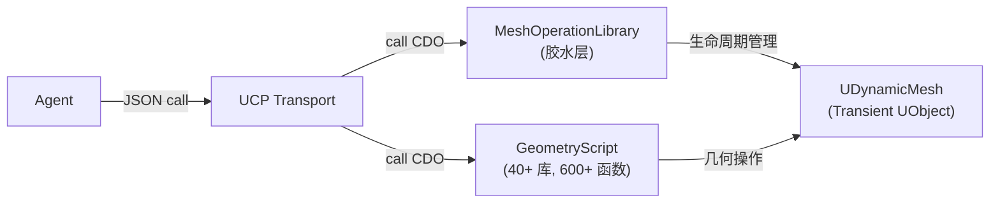
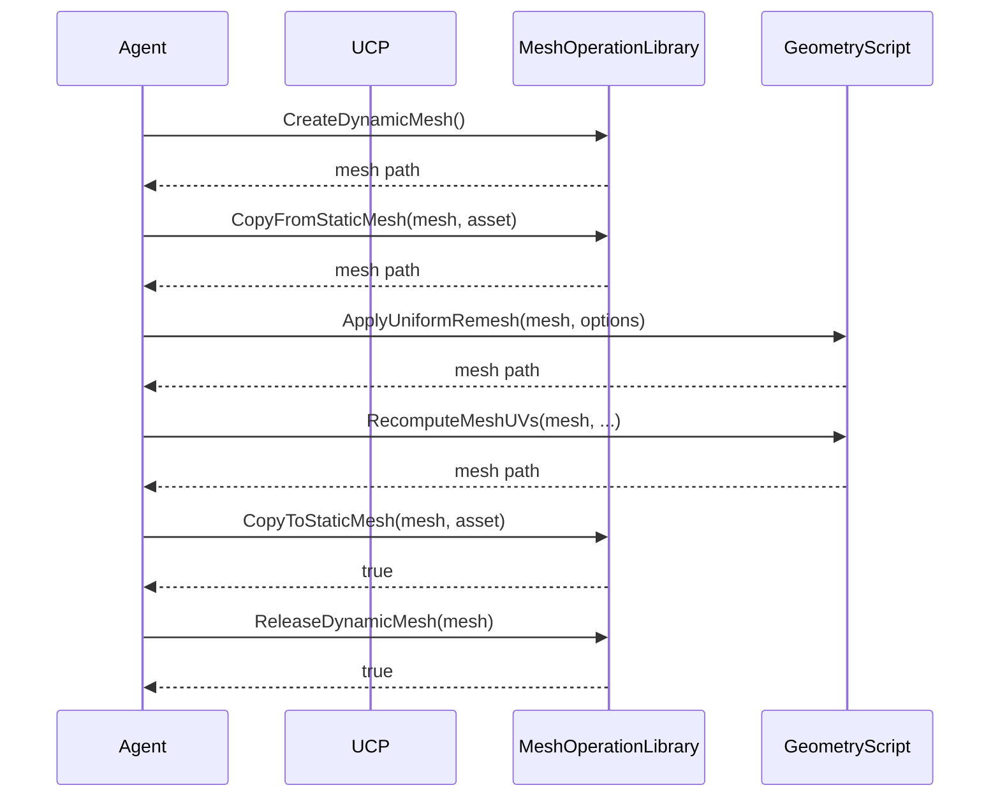

# UCP Mesh Modeling Architecture

> Scope: `UnrealClientProtocol` 建模子系统

## 1. 设计哲学

**薄封装，直接复用 GeometryScript。**

UCP 的通用 `call` 机制已经能调用任何 `UFUNCTION`。GeometryScript 提供 600+ 个 `BlueprintCallable` 静态函数，覆盖几乎所有程序化建模需求。UCP 不重复封装这些函数——只补充 GeometryScript 自身缺失的胶水能力。

## 2. 架构总览



### 两条调用路径

1. **MeshOperationLibrary**（UCP 自有）：DynamicMesh 生命周期管理、资产 I/O 简化、不可序列化类型桥接
2. **GeometryScript 原生库**（UE 内置）：所有几何操作直接通过 UCP 通用 call 调用

## 3. MeshOperationLibrary

CDO: `/Script/UnrealClientProtocolEditor.Default__MeshOperationLibrary`

### 3.1 职责边界

只做 GeometryScript 不做的事：

| 职责 | 原因 |
|------|------|
| DynamicMesh 创建/释放/列举 | GeometryScript 假设调用者已持有 mesh |
| 资产 I/O 简化 | 原生函数需要构造复杂 Options struct |
| 不可序列化类型桥接 | GeometryScript 的 List/Selection/Path 类型使用 TSharedPtr 存储数据，无法通过 JSON 序列化 |

### 3.2 不可序列化类型问题

GeometryScript 的以下类型将真实数据存储在 `TSharedPtr<TArray<...>>` 中，不是 `UPROPERTY`，UCP 的 JSON 转换器无法读写：

| 类型 | 不可序列化的成员 |
|------|-----------------|
| `FGeometryScriptMeshSelection` | `TSharedPtr<FGeometrySelection>` |
| `FGeometryScriptIndexList` | `TSharedPtr<TArray<int>> List` |
| `FGeometryScriptVectorList` | `TSharedPtr<TArray<FVector>> List` |
| `FGeometryScriptPolyPath` | `TSharedPtr<TArray<FVector>> Path` |
| `FGeometryScriptSimplePolygon` | `TSharedPtr<TArray<FVector2D>> Vertices` |
| `FGeometryScriptColorList` | `TSharedPtr<TArray<FLinearColor>> List` |
| `FGeometryScriptUVList` | `TSharedPtr<TArray<FVector2D>> List` |
| `FGeometryScriptScalarList` | `TSharedPtr<TArray<double>> List` |
| `FGeometryScriptTriangleList` | `TSharedPtr<TArray<FIntVector>> List` |
| `FGeometryScriptDynamicMeshBVH` | `TSharedPtr<FDynamicMeshAABBTree3>` |

MeshOperationLibrary 提供 `Make*` / `Get*Array` 桥接函数，将 `TArray<T>`（可序列化）与这些类型互转。

### 3.3 API 清单

**生命周期**

| 函数 | 参数 | 返回 |
|------|------|------|
| `CreateDynamicMesh` | — | `UDynamicMesh*` |
| `ReleaseDynamicMesh` | `Mesh` | `bool` |
| `ReleaseAllDynamicMeshes` | — | — |
| `ListDynamicMeshes` | — | `TArray<FString>` |

**摘要**

| 函数 | 参数 | 返回 |
|------|------|------|
| `GetMeshSummary` | `TargetMesh` | JSON string |

**资产 I/O**

| 函数 | 参数 | 返回 |
|------|------|------|
| `CopyFromStaticMesh` | `TargetMesh`, `SourceStaticMesh` | `UDynamicMesh*` |
| `CopyToStaticMesh` | `SourceMesh`, `TargetStaticMesh` | `bool` |
| `CopyToNewStaticMeshAsset` | `SourceMesh`, `AssetPath` | 新资产路径 |

**Selection 桥接**

| 函数 | 参数 | 返回 |
|------|------|------|
| `SelectAllTriangles` | `TargetMesh` | `FGeometryScriptMeshSelection` |
| `SelectTrianglesByIDs` | `TargetMesh`, `TriangleIDs` | `FGeometryScriptMeshSelection` |
| `SelectVerticesByIDs` | `TargetMesh`, `VertexIDs` | `FGeometryScriptMeshSelection` |
| `SelectPolygroupByID` | `TargetMesh`, `PolygroupID`, `GroupLayer` | `FGeometryScriptMeshSelection` |
| `SelectMaterialByID` | `TargetMesh`, `MaterialID` | `FGeometryScriptMeshSelection` |
| `GetSelectionIDs` | `Selection` | `TArray<int32>` |

**数据类型桥接**

| Make 函数 | Get 函数 | 桥接类型 |
|-----------|----------|----------|
| `MakeIndexList(TArray<int32>, IndexType)` | `GetIndexListArray` | `FGeometryScriptIndexList` |
| `MakeVectorList(TArray<FVector>)` | `GetVectorListArray` | `FGeometryScriptVectorList` |
| `MakePolyPath(TArray<FVector>, bClosedLoop)` | `GetPolyPathArray` | `FGeometryScriptPolyPath` |
| `MakeSimplePolygon(TArray<FVector2D>)` | `GetSimplePolygonArray` | `FGeometryScriptSimplePolygon` |
| `MakeColorList(TArray<FLinearColor>)` | `GetColorListArray` | `FGeometryScriptColorList` |
| `MakeUVList(TArray<FVector2D>)` | `GetUVListArray` | `FGeometryScriptUVList` |
| `MakeScalarList(TArray<double>)` | `GetScalarListArray` | `FGeometryScriptScalarList` |
| `MakeTriangleList(TArray<FIntVector>)` | `GetTriangleListArray` | `FGeometryScriptTriangleList` |

## 4. GeometryScript 直接调用

### 4.1 CDO 命名规则

```
/Script/GeometryScriptingCore.Default__GeometryScriptLibrary_<ClassName>
/Script/GeometryScriptingEditor.Default__GeometryScriptLibrary_<ClassName>
```

### 4.2 参数传递规则

| 参数类型 | JSON 表示 |
|----------|-----------|
| `UDynamicMesh*` | 路径字符串（如 `"/Engine/Transient.DynamicMesh_0"`） |
| `UStaticMesh*` | 资产路径字符串 |
| `USTRUCT` Options | JSON 对象，字段名 = UPROPERTY 名，可省略使用默认值 |
| `UENUM` | 字符串（枚举值名，如 `"Automatic"`） |
| `out` 参数 | 省略，UCP 自动初始化并在返回值中包含 |
| `Debug` 参数 | 省略（默认 nullptr） |
| `WorldContextObject` | 自动注入，不需要传 |

### 4.3 库索引

**GeometryScriptingCore**（40+ 库）

| 库 | CDO 后缀 | 函数数 | 域 Skill |
|----|----------|--------|----------|
| MeshPrimitiveFunctions | `_MeshPrimitiveFunctions` | 38 | `unreal-modeling-primitives` |
| MeshModelingFunctions | `_MeshModelingFunctions` | 12 | `unreal-modeling-primitives` |
| MeshRepairFunctions | `_MeshRepairFunctions` | 11 | `unreal-modeling-meshops` |
| MeshSimplifyFunctions | `_MeshSimplifyFunctions` | 9 | `unreal-modeling-meshops` |
| RemeshingFunctions | `_RemeshingFunctions` | 1 | `unreal-modeling-meshops` |
| MeshBooleanFunctions | `_MeshBooleanFunctions` | 6 | `unreal-modeling-meshops` |
| MeshVoxelFunctions | `_MeshVoxelFunctions` | 2 | `unreal-modeling-meshops` |
| MeshDecompositionFunctions | `_MeshDecompositionFunctions` | 11 | `unreal-modeling-meshops` |
| MeshBasicEditFunctions | `_MeshBasicEditFunctions` | 21 | `unreal-modeling-meshops` |
| MeshSubdivideFunctions | `_MeshSubdivideFunctions` | 3 | `unreal-modeling-meshops` |
| MeshUVFunctions | `_MeshUVFunctions` | 29 | `unreal-modeling-uv` |
| MeshNormalsFunctions | `_MeshNormalsFunctions` | 18 | `unreal-modeling-normals` |
| MeshDeformFunctions | `_MeshDeformFunctions` | 9 | `unreal-modeling-deform` |
| MeshTransformFunctions | `_MeshTransformFunctions` | 11 | `unreal-modeling-deform` |
| MeshQueryFunctions | `_MeshQueryFunctions` | 49 | `unreal-modeling-query` |
| MeshSelectionFunctions | `_MeshSelectionFunctions` | 27 | `unreal-modeling-selection` |
| MeshVertexColorFunctions | `_MeshVertexColorFunctions` | 8 | `unreal-modeling-attributes` |
| MeshPolygroupFunctions | `_MeshPolygroupFunctions` | 19 | `unreal-modeling-attributes` |
| MeshMaterialFunctions | `_MeshMaterialFunctions` | 17 | `unreal-modeling-attributes` |
| CollisionFunctions | `_CollisionFunctions` | 23 | `unreal-modeling-asset` |
| MeshSpatialFunctions | `_MeshSpatialFunctions` | 8 | `unreal-modeling-query` |
| MeshSamplingFunctions | `_MeshSamplingFunctions` | 6 | `unreal-modeling-query` |
| ContainmentFunctions | `_ContainmentFunctions` | 4 | `unreal-modeling-query` |
| MeshComparisonFunctions | `_MeshComparisonFunctions` | 3 | `unreal-modeling-query` |
| ListUtilityFunctions | `_ListUtilityFunctions` | 56 | (通用工具) |
| PolyPathFunctions | `_PolyPathFunctions` | 21 | `unreal-modeling-primitives` |
| SimplePolygonFunctions | `_SimplePolygonFunctions` | ~20 | `unreal-modeling-primitives` |
| PolygonListFunctions | `_PolygonListFunctions` | ~17 | `unreal-modeling-primitives` |
| MeshBoneWeightFunctions | `_MeshBoneWeightFunctions` | 20 | (骨骼权重) |
| MeshGeodesicFunctions | `_MeshGeodesicFunctions` | 3 | `unreal-modeling-query` |
| PointSetFunctions | `_PointSetFunctions` | 9 | (点集) |
| SceneUtilityFunctions | `_SceneUtilityFunctions` | 5 | (场景工具) |

**GeometryScriptingEditor**（4 库）

| 库 | CDO 后缀 | 函数数 | 域 Skill |
|----|----------|--------|----------|
| CreateNewAssetFunctions | `_CreateNewAssetFunctions` | 8 | `unreal-modeling-asset` |
| EditorDynamicMeshFunctions | `_EditorDynamicMeshFunctions` | 4 | `unreal-modeling-asset` |
| OpenSubdivFunctions | `_OpenSubdivFunctions` | 2 | `unreal-modeling-meshops` |

## 5. 标准工作流



## 6. Skill 体系

1 个核心 Skill + 9 个域 Skill：

| Skill | 覆盖范围 |
|-------|----------|
| `unreal-modeling` | 核心入口：MeshOperationLibrary API、CDO 规则、参数格式、工作流示例 |
| `unreal-modeling-primitives` | 图元创建、路径/多边形建模 |
| `unreal-modeling-meshops` | 修复、简化、Remesh、Boolean、Voxel、分解、基础编辑、细分 |
| `unreal-modeling-uv` | UV 生成、投影、布局、变换 |
| `unreal-modeling-normals` | 法线、切线计算 |
| `unreal-modeling-deform` | 变形、变换 |
| `unreal-modeling-query` | 查询、空间、采样、比较、测地线 |
| `unreal-modeling-selection` | 选择创建、转换、组合 |
| `unreal-modeling-attributes` | 顶点色、Polygroup、材质 ID |
| `unreal-modeling-asset` | 资产 I/O、碰撞、新建资产 |
