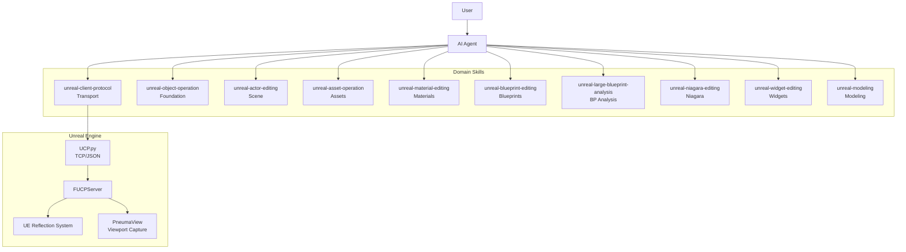
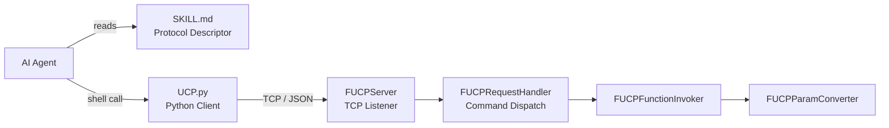
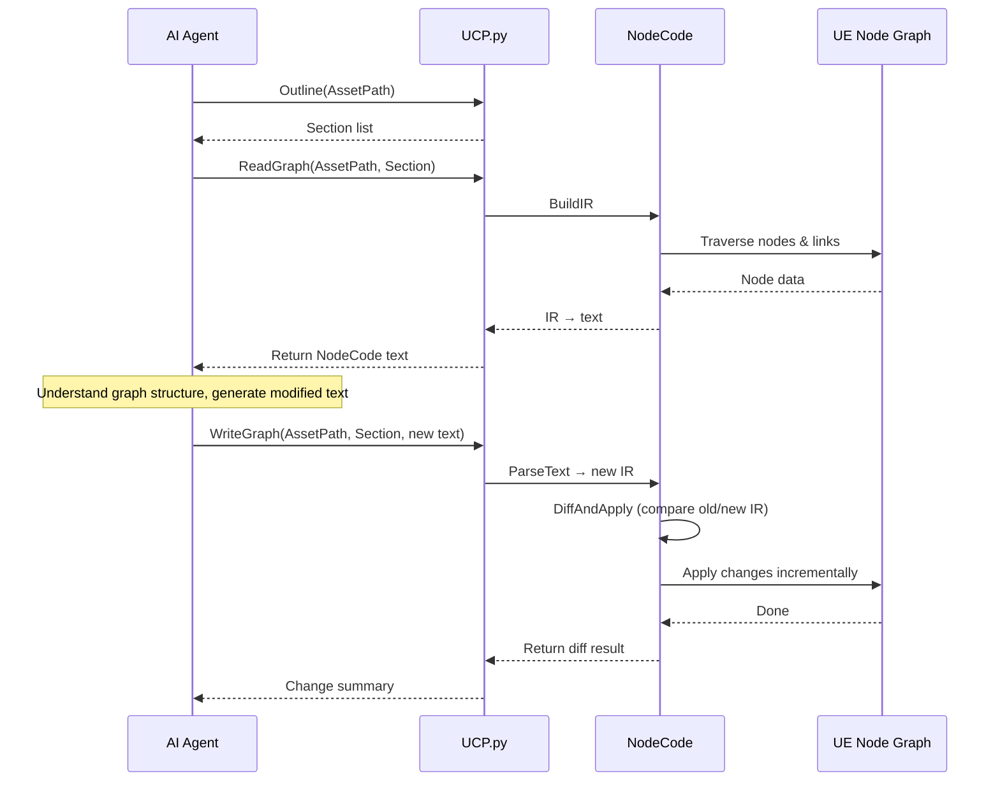
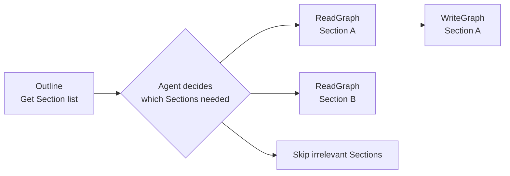
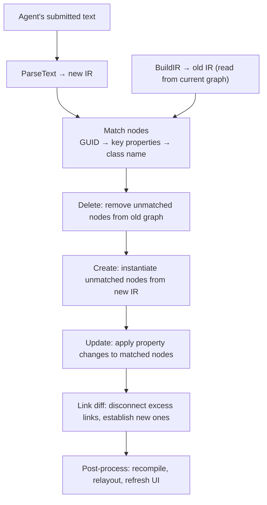
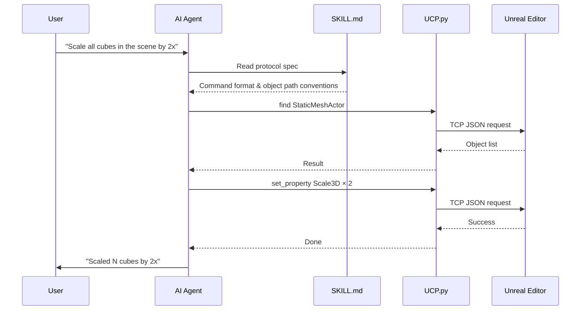

<p align="center">
  <h1 align="center">UnrealClientProtocol</h1>
  <p align="center">
    <strong>Give your AI Agent a pair of hands that reach into Unreal Engine.</strong>
  </p>
  <p align="center">
    <a href="LICENSE"></a>
    <a href="https://www.unrealengine.com/"></a>
    <a href="https://www.python.org/"></a>
    <a href="#3-install-agent-skills-and-rules"></a>
    <a href="README.md"></a>
  </p>
</p>

---

UnrealClientProtocol (UCP) is an atomic client communication protocol designed for AI Agents. Its core design philosophy is:

- **Don't make decisions for the Agent — give it capability.**

Traditional UE automation requires writing dedicated interfaces or scripts for every operation. UCP takes the opposite approach — it exposes only the engine's atomic capabilities (call any UFunction, read/write any UPROPERTY, find objects, introspect metadata), then trusts the AI Agent's own understanding of the Unreal Engine API to compose these primitives into arbitrarily complex tasks.

This means:

- **You don't need to predefine "what it can do."** The Agent isn't limited to a fixed set of predefined commands — it has access to every function and property exposed by the engine's reflection system. If the engine can do it, the Agent can do it.
- **You can shape Agent behavior with Skills.** By authoring custom Skill files, you can inject domain knowledge into specific workflows — level design conventions, asset naming rules, material authoring strategies — and the Agent will combine this knowledge with the UCP protocol to work the way you define.
- **Capabilities grow as models evolve.** The UCP protocol layer is stable, while AI comprehension is continuously improving. Today the Agent might need `describe` to explore an unfamiliar class; tomorrow it may already know it by heart. You don't need to change a single line of code to benefit from AI progress.

## Why AI Agent + Atomic Protocol + Domain Skills Changes Everything

### LLMs Already Understand Unreal Engine

Ask any large language model — even one not specialized for coding — "How do you get all Actors in UE via Blueprint? What's the exact function signature?" Most LLMs can answer accurately:

```C++
static void UGameplayStatics::GetAllActorsOfClass(const UObject* WorldContextObject, TSubclassOf<AActor> ActorClass, TArray<AActor*>& OutActors)
```

This demonstrates that **LLMs already possess deep knowledge of Unreal Engine** — and this is exactly where UCP stands. Since LLMs already understand UE's reflection system, know common module APIs, and can map Blueprint nodes to their underlying C++ functions, all we need is a simple JSON call format for the LLM to generate:

```json
{
  "object": "/Script/Engine.Default__GameplayStatics",
  "function": "GetAllActorsOfClass",
  "params": {
    "ActorClass": "/Game/Blueprints/BP_Enemy.BP_Enemy_C"
  }
}
```

At its core, UCP provides just one atomic capability — **calling any reflected function in Unreal Engine via JSON**.

On the engine side, this takes only 5 steps:

1. `FindTargetObject` — locate the target UObject by path
2. `FindTargetFunction` — find the target UFunction on the object
3. Construct a parameter buffer from UFunction reflection metadata, using UE's native serialization to write text parameters into memory
4. `ProcessEvent` — invoke the function
5. Parse return parameters and send back to the Agent

Beyond the core call chain, UCP provides several key guarantees:

- **Log Capture**: Automatically intercepts engine logs during function execution and returns them to the Agent for diagnosis and self-correction.
- **Transaction Safety**: Property modifications are automatically wrapped in the Undo/Redo system; the Agent can roll back any failed operation.
- **Deferred Response**: The `DeferredResponse` mechanism supports async completion — long-running operations (screenshots, compilation) don't block subsequent requests.
- **Script Aggregation**: For predictably complex operations, Skills guide the Agent to generate a Python script first, then execute it via `ExecutePythonScript` in one shot, drastically reducing round-trip tool calls.

But knowledge alone isn't capability. The "balanced" nature of LLMs means they tend toward generic, conservative responses without guidance — they know how to do it, but won't proactively act.

What UCP does is simple:

- **Give them hands (the protocol) plus a behavioral framework (Skills), turning existing knowledge into actual action.**

But it's important to note: the distance from a demo-level effect to a production-grade engineered material isn't about protocol capability — it's about **domain experience**. Take materials as an example:

- **Workflow experience**: Repeated logic should be abstracted into Material Functions; prefer a single parent material covering more variants over creating separate materials for each effect.
- **Craft experience**: Scene, character, VFX, and UI each have different material strategies; classic techniques (FlowMap, parallax mapping, distance field blending) have proven node composition patterns.
- **Self-feedback loops**: The Agent should be able to validate its own output — compile the material, check instruction count, compare against expected results — then distill successful experiences into new Skill knowledge.

This is the evolutionary direction of Skills: **not a one-time instruction manual, but a continuously accumulating, ever-refining experience base.** Every successful creation can feed back into more precise Skill descriptions, making the Agent better next time.

### Skill Memory Layering & Self-Iteration — A Sustainably Evolving Architecture

The Agent community is adopting a memory layer strategy called "Skills". UCP has implemented a complete Skill layering and self-iteration architecture:

**Metadata-driven layering**: Each SKILL.md declares its layer (transport/foundation/convention/domain/composite), parent dependency, and tags via the `metadata` field. The Agent loads knowledge hierarchically.

**Hierarchical routing**: A Cursor Rule (`skill-taxonomy.mdc`) describes the full Skill hierarchy, automatically guiding the Agent's skill selection in every conversation.

**Usage tracking**: Cursor Hooks automatically record Skill usage frequency and session success/failure status, providing data for iteration decisions.

**Self-iteration protocol**: A Cursor Rule (`skill-evolution.mdc`) defines an "analyze → propose → review → execute" closed-loop process, enabling the Agent to improve Skills under user guidance.

```
Agent/
├── skills/                         # Domain Skills (SKILL.md + optional scripts)
│   ├── unreal-client-protocol/     # Transport: protocol spec, invocation patterns
│   ├── unreal-object-operation/    # Foundation: property R/W, object search, metadata
│   ├── unreal-actor-editing/       # Foundation: Actor lifecycle management
│   ├── unreal-asset-operation/     # Foundation: search, dependencies, CRUD
│   ├── unreal-nodecode-common/     # Convention: shared NodeCode graph-editing rules
│   ├── unreal-material-editing/    # Domain: material node graphs
│   ├── unreal-blueprint-editing/   # Domain: Blueprint node graphs
│   ├── unreal-niagara-editing/     # Domain: Niagara particle systems
│   ├── unreal-widget-editing/      # Domain: UMG Widget UI
│   ├── unreal-modeling/            # Domain: GeometryScript procedural modeling
│   └── ...
├── rules/                          # Cursor Rules (routing + self-iteration)
│   ├── skill-taxonomy.mdc
│   └── skill-evolution.mdc
└── scripts/                        # Utility scripts
    ├── sync-agent.ps1
    └── skill-report.py
```

See the [Skill Evolution Architecture Document](Docs/SkillEvolution.md) for detailed specifications.

## Features

- **Zero Intrusion** — Pure plugin architecture; drop into `Plugins/` and go, no engine source changes required
- **Reflection-Driven** — Leverages UE's native reflection system to automatically discover all `UFunction` and `UPROPERTY` fields
- **Minimal Protocol** — Only `call` command, covering every reflectable operation in the engine
- **Editor Integration** — Property writes are automatically registered with the Undo/Redo system
- **WorldContext Auto-Injection** — No need to manually pass WorldContext parameters
- **Security Controls** — Loopback-only binding, class path allowlists, and function blocklists
- **Batteries-Included Python Client** — Lightweight CLI script to talk to the engine in one line
- **Visual Perception** — Built-in PneumaView viewport system for creating independent preview windows, multi-angle screenshots, letting the Agent "see" its own results
- **Deferred Response** — Supports async completion for long-running operations without blocking subsequent requests
- **Domain Skill Ecosystem** — 24 specialized Skills covering objects, Actors, assets, materials, Blueprints, Niagara, Widgets, modeling, and more; Agent loads domain knowledge on demand
- **Multi-Tool Compatible** — Skill descriptors work with Cursor / Claude Code / OpenCode and other mainstream AI coding tools

## Skill Ecosystem

The UCP protocol layer provides "atomic capabilities" — calling functions, reading/writing properties. **Domain Skills** organize these atomic capabilities into domain-specific work patterns, letting the Agent load the right expertise for each task scenario.

Currently available Skills:

| Skill | Layer | Capabilities |
|-------|-------|-------------|
| `unreal-client-protocol` | Transport | TCP/JSON communication, `call` protocol, error handling & self-correction |
| `unreal-object-operation` | Foundation | Any UObject property R/W, metadata introspection, instance search, derived class discovery, Undo/Redo |
| `unreal-actor-editing` | Foundation | Actor spawn / delete / duplicate / move / select, level queries, viewport control |
| `unreal-asset-operation` | Foundation | AssetRegistry search, dependency & reference analysis, asset CRUD, editor operations |
| `unreal-material-editing` | Domain | Text-based material node graph R/W, Custom HLSL, material instance editing, compilation & stats |
| `unreal-blueprint-editing` | Domain | Text-based Blueprint node graph R/W, function / event / macro editing, variable creation, auto-compilation |
| `unreal-large-blueprint-analysis` | Composite | Systematic large Blueprint (10+ functions) analysis, C++ translation, logic auditing |
| `unreal-nodecode-common` | Convention | Common rules and conventions for NodeCode graph editing |
| `unreal-niagara-editing` | Domain | Niagara system/emitter/script editing, module stack management, parameter binding |
| `unreal-widget-editing` | Domain | Text-based UMG Widget Blueprint UI layout editing |
| `unreal-pie-control` | Composite | Play In Editor / Simulate In Editor session control |
| `unreal-live-coding` | Composite | Live Coding runtime C++ recompilation |
| `unreal-modeling` | Domain | GeometryScript procedural mesh modeling (with 10 sub-Skills) |
| `unreal-plugin-localization` | Workflow | Plugin UI text translation workflow |

Each Skill is a standalone SKILL.md file that the Agent reads on demand when receiving a task. Skills naturally chain through the UCP protocol layer — for example, creating a material requires `unreal-asset-operation`'s asset creation + `unreal-material-editing`'s node graph editing + `unreal-object-operation`'s property setting; the Agent automatically combines multiple Skills to complete composite tasks.

## How It Works

### Architecture Overview



### Transport Layer Detail



### NodeCode: Text-Based Intermediate Representation for Node Graphs

For visual node graphs like materials and Blueprints, creating nodes one by one via `call`, setting properties, and wiring pins is both tedious and error-prone.
UCP introduces a NodeCode syntax — a **text-based intermediate representation (IR)** that lets AI edit node graphs as naturally as editing code.

NodeCode organizes content by Section, each marked with square brackets. Graph-type Sections contain node lines with indented connection lines beneath them:

```
[Material]

N_0a1B2c3D4e5F6g7H8i9J0k ScalarParameter {ParameterName:"Roughness", DefaultValue:0.5}
  > -> N_1b2C3d4E5f6G7h8I9j0K1l.A

N_1b2C3d4E5f6G7h8I9j0K1l Multiply
  > -> [BaseColor]
```

- **Section header**: `[Type:Name]` (e.g. `[Function:MyFunc]`) or `[Type]` (e.g. `[Material]`, `[EventGraph]`)
- **Node line**: `N_<Base62ID> <ClassName> {properties}` — Base62 ID is a compact GUID encoding (22 chars), ensuring stable identity across read/write cycles. New nodes use temporary IDs like `N_new0`, `N_new1`
- **Link line**: Indented under the owning node, starting with `>`. `> OutputPin -> N_<id>.InputPin` or `> -> [GraphOutput]` (omit output pin name = single-output node)

#### AI Interaction Flow



#### On-Demand Reading Strategy

A complex material may have dozens of output pins and sub-graphs; a Blueprint may contain multiple functions and event graphs.

Serializing everything at once wastes tokens and floods the context window.

NodeCode therefore introduces an **Outline** mechanism — the Agent first gets the table of contents, then reads on demand:



For materials, `Outline` returns all Sections (`[Material]` main graph, `[Composite:<name>]` sub-graphs, etc.). The Agent reads only the relevant Sections based on the task — editing the main graph only requires `ReadGraph("[Material]")`, no need to load the entire material graph. Writes are submitted at the same Section granularity; the incremental diff only affects nodes within that Section, leaving everything else untouched.

Additionally, `ResolveNodeId` allows the Agent to look up the UObject path for a given node ID, enabling further operations (e.g., reading detailed node properties).

#### Programmatic Processing: Diff & Apply

After the Agent modifies the text, NodeCode doesn't rebuild the entire graph — it applies changes precisely through incremental diff:



Advantages of this incremental strategy:

- **Minimal changes**: Only modifies what actually changed, leaving other nodes and links untouched
- **External link safety**: Links outside the current Section are never affected
- **Protected nodes**: Critical nodes like FunctionEntry / FunctionResult are never accidentally deleted
- **Automatic post-processing**: Materials auto-recompile, Blueprints auto-mark as needing compilation

#### Supported Graph Types

| Graph Type | Section Model |
|------------|---------------|
| Material | `[Material]` main graph, `[Composite:<name>]` sub-graphs |
| Blueprint | `[EventGraph]`, `[Function:<name>]`, `[Macro:<name>]` |
| Niagara | `[SystemSpawn]`/`[SystemUpdate]`, `[EmitterSpawn]`/`[EmitterUpdate]`, `[ParticleSpawn]`/`[ParticleUpdate]` |
| Widget | `[WidgetTree]` (indented tree), `[EventGraph]`, `[Function:<name>]` |

All graph types are operated through `UNodeCodeEditingLibrary`'s unified API: `Outline` / `ReadGraph` / `WriteGraph` / `ResolveNodeId`.

See the [NodeCode Architecture Document](Docs/NodeCode.md) for detailed format specifications and usage.

## Quick Start

### 1. Install the Plugin

Copy the `UnrealClientProtocol` folder into your project's `Plugins/` directory and restart the editor to compile.

### 2. Verify the Connection

Once the editor starts, the plugin automatically listens on `127.0.0.1:9876`. Test it with the bundled Python client:

```bash
echo '{"object":"/Script/UnrealClientProtocol.Default__ObjectOperationLibrary","function":"FindObjectInstances","params":{"ClassName":"/Script/Engine.World"}}' | python Plugins/UnrealClientProtocol/Agent/skills/unreal-client-protocol/scripts/UCP.py
```

If you see a list of World objects, you're all set.

### 3. Install Agent Skills and Rules

The plugin ships with a complete Skill and Rule suite under [`Agent/`](./Agent/). You can copy them manually, or simply ask the Agent to do it for you.

**Option A: Let the Agent install (recommended)**

Send this instruction to your Agent:

> "Copy all Skill folders from `Plugins/UnrealClientProtocol/Agent/skills/` to the project's `.cursor/skills/` directory, and copy all files from `Agent/rules/` to `.cursor/rules/`"

The Agent will handle the file copying automatically.

**Option B: Manual copy**

Copy the contents of `Agent/` into your AI coding tool's corresponding directories:

| Content | Source Path | Cursor | Claude Code | OpenCode |
|---------|-------------|--------|-------------|----------|
| Skills | `Agent/skills/` | `.cursor/skills/` | `.claude/skills/` | `.opencode/skills/` |
| Rules | `Agent/rules/` | `.cursor/rules/` | — | — |

Or simply run: `powershell Agent/scripts/sync-agent.ps1`

The resulting directory structure:

```
.cursor/
├── skills/                                  # Domain Skills
│   ├── unreal-client-protocol/
│   │   ├── SKILL.md                         # Transport protocol descriptor
│   │   └── scripts/
│   │       └── UCP.py                       # Python client
│   ├── unreal-object-operation/
│   │   └── SKILL.md                         # Object operations
│   ├── unreal-actor-editing/
│   │   └── SKILL.md                         # Actor operations
│   ├── unreal-asset-operation/
│   │   └── SKILL.md                         # Asset operations
│   ├── unreal-material-editing/
│   │   └── SKILL.md                         # Material editing
│   ├── unreal-blueprint-editing/
│   │   └── SKILL.md                         # Blueprint editing
│   ├── unreal-large-blueprint-analysis/
│   │   └── SKILL.md                         # Large Blueprint analysis
│   ├── unreal-niagara-editing/
│   │   └── SKILL.md                         # Niagara editing
│   ├── unreal-widget-editing/
│   │   └── SKILL.md                         # Widget editing
│   ├── unreal-modeling/
│   │   └── SKILL.md                         # Mesh modeling (with sub-Skills)
│   └── ...
└── rules/                                   # Cursor Rules
    ├── skill-taxonomy.mdc                   # Hierarchical routing
    └── skill-evolution.mdc                  # Self-iteration protocol
```

**Resolving Script Execution Policy Issues (Windows)**

On Windows, PowerShell's default execution policy may prevent the Agent from running Python scripts. If you encounter a "cannot be loaded because running scripts is disabled on this system" error, open PowerShell as **Administrator** and run:

```powershell
Set-ExecutionPolicy RemoteSigned -Scope CurrentUser
```

Or simply ask the Agent to run this command for you.

Once configured, when the Agent receives Unreal Engine-related instructions, it will automatically read the relevant SKILL.md and communicate with the editor via `scripts/UCP.py`.

> **Workflow**: User gives an instruction → Agent identifies and reads SKILL.md → Builds JSON commands per the protocol → Sends via `UCP.py` → Returns results



### 4. Verify Agent Functionality

Send the following test prompts to your Agent to confirm the Skills are configured correctly:

- **Query the scene**: "Show me what's in the current scene"
- **Read a property**: "What real-world time does the current sunlight correspond to?"
- **Modify a property**: "Change the time to 6 PM"
- **Call a function**: "Call GetPlatformUserName to check the current username"
- ...

If the Agent automatically constructs the correct JSON commands, invokes `UCP.py`, and returns results, the setup is complete.

## Configuration

Configure via **Editor → Project Settings → Plugins → UCP**:

| Setting | Type | Default | Description |
|---------|------|---------|-------------|
| `bEnabled` | bool | `true` | Enable or disable the plugin |
| `Port` | int32 | `9876` | TCP listen port (1024–65535) |
| `bLoopbackOnly` | bool | `true` | Bind to 127.0.0.1 only |
| `AllowedClassPrefixes` | TArray\<FString\> | empty | Class path allowlist prefixes; empty = no restriction |
| `BlockedFunctions` | TArray\<FString\> | empty | Function blocklist; supports `ClassName::FunctionName` format |

## Known Limitations

- **Latent functions** (those with `FLatentActionInfo` parameters) are not supported
- **Delegates** cannot be passed as parameters

## Roadmap

- [x] Atomic protocol (call / reflection-driven)
- [x] Object operations (property R/W, metadata introspection, instance search, Undo/Redo)
- [x] Actor operations (spawn, delete, duplicate, select, transform)
- [x] Asset management (AssetRegistry search, dependency analysis, CRUD, editor operations)
- [x] Material text serialization (node graph R/W, Custom HLSL, material instance editing)
- [x] Blueprint text serialization (node graph R/W, function / event / macro editing, large Blueprint analysis & C++ translation)
- [x] Widget text serialization (widget tree R/W, UI layout editing)
- [x] Niagara editing (system/emitter/script management, module stack operations)
- [x] Procedural modeling (GeometryScript mesh creation/modification/repair/simplify/UV/boolean)
- [x] PIE control (start/stop/pause Play In Editor)
- [x] Live Coding (runtime C++ recompilation)
- [x] Plugin localization (PO file translation workflow)
- [x] Visual perception (PneumaView independent viewport, multi-angle screenshots, view mode switching)
- [x] Skill layering & self-iteration (metadata, hierarchical routing Rule, Hooks usage tracking, self-iteration protocol)

## License

[MIT License](LICENSE) — Copyright (c) 2025 [Italink](https://github.com/Italink)
